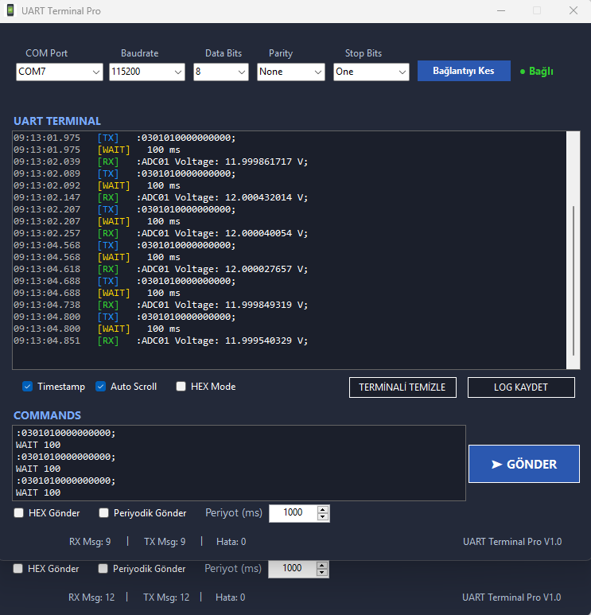

# UART Terminal Pro

**Türkçe** • [English](README.en.md)

Gömülü sistem geliştirme ve test otomasyonu için geliştirilmiş modern bir UART haberleşme uygulaması.

> C# • .NET Framework 4.8 • Windows Forms

---

## ✨ Özellikler

- **Seri bağlantı yönetimi** — COM portları otomatik bulur ve sıralar; tek tıkla bağlan/kes.
- **Tam yapılandırma** — Baudrate, Data Bits, Parity, Stop Bits seçimi.
- **Renkli terminal** — gelen `[RX]` yeşil, giden `[TX]` mavi, bekleme `[WAIT]` sarı renkte gösterilir.
- **Zaman damgası** — her satıra `HH:mm:ss.fff` formatında isteğe bağlı zaman bilgisi.
- **HEX / ASCII modu** — gelen veriyi ister okunabilir metin, ister onaltılık (hex) olarak görüntüleyin.
- **Satır bazlı komut gönderme** — gönderme kutusuna birden fazla satır yazıp hepsini sırayla yollayın.
- **`WAIT` komutu** — komutlar arasına milisaniye cinsinden gecikme ekleyin (basit script mantığı).
- **HEX gönderme** — komutu onaltılık bayt dizisi olarak gönderin.
- **Periyodik gönderme** — belirlenen periyot (ms) ile komutları otomatik tekrar gönderin.
- **Canlı sayaçlar** — RX mesaj, TX mesaj ve hata sayısı.
- **Otomatik kaydırma** — yeni veri geldikçe terminal en alta iner (açık/kapalı).
- **Log kaydetme** — terminal içeriğini `.txt` / `.log` olarak UTF-8 biçiminde diske yazın.
- **Koyu tema** — göz yormayan lacivert/mavi arayüz.

---

## 🖼️ Ekran Görüntüsü



---

## 🧩 Gereksinimler

- **Windows** (7/10/11)
- **.NET Framework 4.8** çalışma zamanı
- Derlemek için: **Visual Studio 2019/2022** (veya MSBuild ile .NET Framework 4.8 geliştirme araçları)

---

## 🚀 Kurulum ve Çalıştırma

### Hazır çalıştırma
1. Projeyi derleyin ya da paylaşılan sürümü indirin.
2. `bin\Debug\` (veya `bin\Release\`) klasöründeki **`UARTTerminalPro.exe`** dosyasını çalıştırın.

### Kaynaktan derleme
```bash
# Visual Studio ile
UARTTerminalPro.sln dosyasını açın → Build → Run (F5)

# veya MSBuild ile
msbuild UARTTerminalPro.csproj /p:Configuration=Release
```

---

## 📖 Kullanım

### 1. Bağlantı
1. Cihazı bilgisayara bağlayın; uygulama açılışta COM portlarını otomatik listeler.
2. **COM Port**, **Baudrate**, **Data Bits**, **Parity**, **Stop Bits** değerlerini seçin.
   - Varsayılanlar: `115200`, `8`, `None`, `One`.
3. **Bağlan** butonuna tıklayın. Durum göstergesi yeşil **● Bağlı** olur.
   - Tekrar tıklayınca bağlantı kesilir (**● Bağlı Değil**, kırmızı).

### 2. Veri Gönderme
- Alttaki **VERİ GÖNDER** kutusuna komutu yazın ve **➤ GÖNDER**'e basın.
- Birden fazla satır yazarsanız her satır ayrı komut olarak **sırayla** gönderilir.
- **HEX Gönder** işaretliyse, komut onaltılık olarak yorumlanır (örn. `48656C6C6F`).
  - Format: boşluksuz, çift sayıda karakter içeren hex dizisi.

### 3. `WAIT` ile Gecikme
Komut satırları arasına bekleme eklemek için:
```
WAIT 500
```
Bu satır, sonraki komutu göndermeden önce **500 ms** bekler. Terminalde `[WAIT] 500 ms` olarak görünür.

Örnek bir gönderme dizisi:
```
AT
WAIT 1000
AT+VERSION
WAIT 500
AT+RESET
```

### 4. Periyodik Gönderme
1. **Periyot (ms)** alanına aralığı girin (ok tuşlarıyla da ayarlanabilir).
2. **Periyodik Gönder** kutusunu işaretleyin → kutudaki komut(lar) belirlenen aralıkla otomatik gönderilir.
3. İşareti kaldırınca durur.

### 5. Terminal Seçenekleri
| Seçenek | Açıklama |
|---------|----------|
| **Timestamp** | Her satırın başına zaman damgası ekler. |
| **Auto Scroll** | Yeni veri geldikçe otomatik en alta kaydırır. |
| **HEX Mode** | Gelen veriyi onaltılık (hex) gösterir. |

### 6. Diğer Butonlar
| Buton | İşlev |
|-------|-------|
| **TERMİNALİ TEMİZLE** | Terminali ve sayaçları sıfırlar. |
| **LOG KAYDET** | Terminal içeriğini `.txt` / `.log` dosyasına kaydeder. |
| **YAZIYI KOPYALA** | Terminal metnini kopyalama (arayüzde mevcut). |

---

## 🗂️ Proje Yapısı

```
UARTTerminalPro/
├── Program.cs              # Uygulama giriş noktası
├── Form1.cs                # Ana pencere mantığı (seri port, gönderme, log vb.)
├── Form1.Designer.cs       # Arayüz tasarımı (kontroller, yerleşim, renkler)
├── Form1.resx              # Form kaynakları
├── App.config              # .NET Framework çalışma zamanı yapılandırması
├── Uart.ico                # Uygulama simgesi
├── Properties/             # AssemblyInfo, Settings, Resources
└── UARTTerminalPro.sln     # Visual Studio çözüm dosyası
```

---

## 🔧 Teknik Detaylar

- **Dil / Çatı:** C#, .NET Framework 4.8, Windows Forms (WinExe).
- **Seri haberleşme:** `System.IO.Ports.SerialPort`.
- **Veri alımı:** `DataReceived` olayı arka planda tetiklenir; arayüz `Invoke` ile thread-güvenli güncellenir.
- **Gönderme:** `async/await` ile satır satır; `WAIT` komutu `Task.Delay` kullanır.
- **Periyodik gönderme:** `System.Windows.Forms.Timer` ile.
- **Log biçimi:** UTF-8, varsayılan dosya adı `UART_Log_yyyyMMdd_HHmmss.txt`.

---

## 📝 Notlar

- **Hata sayacı** arayüzde gösterilir; ilerleyen sürümlerde hata yakalama mantığına bağlanabilir.
- Bağlantı hataları sessizce yakalanır; geçersiz port/parametre seçiminde uygulama çökmez.
- HEX gönderiminde komutun geçerli (boşluksuz, çift uzunlukta) bir hex dizisi olması beklenir.

---

## 📦 Sürüm

İlk yayın — temel UART terminal işlevleri tamamlandı.

---

## 📄 Lisans

Bu proje **MIT Lisansı** ile lisanslanmıştır. Ayrıntılar için [LICENSE](LICENSE) dosyasına bakın.

---

> Bu uygulama, gömülü sistem / mikrodenetleyici geliştirme ve seri port testleri için pratik bir
> yardımcıdır. Geri bildirim ve katkılar memnuniyetle karşılanır.
